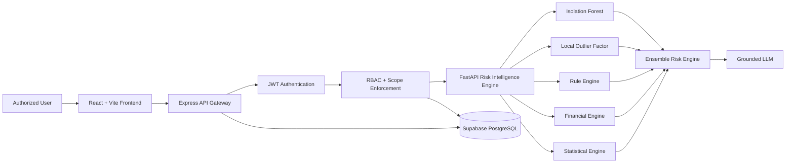
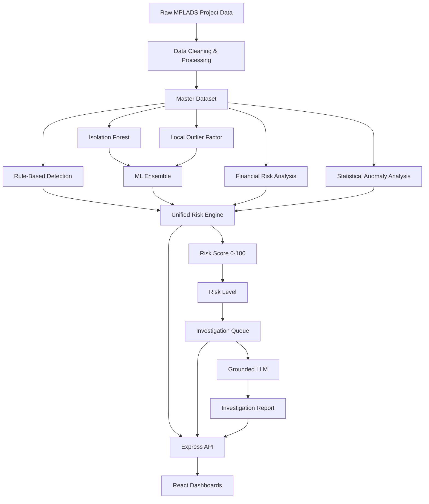
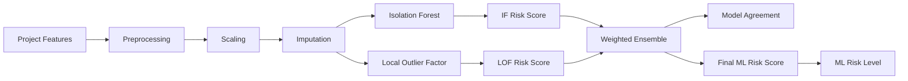
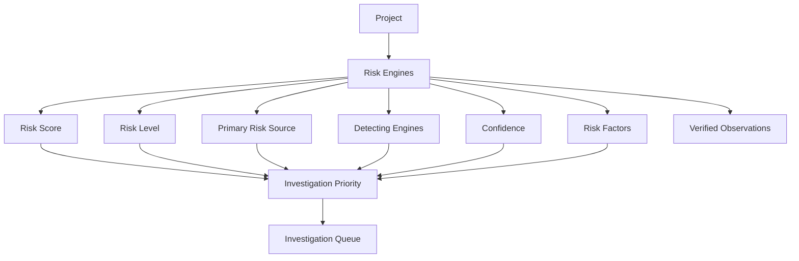
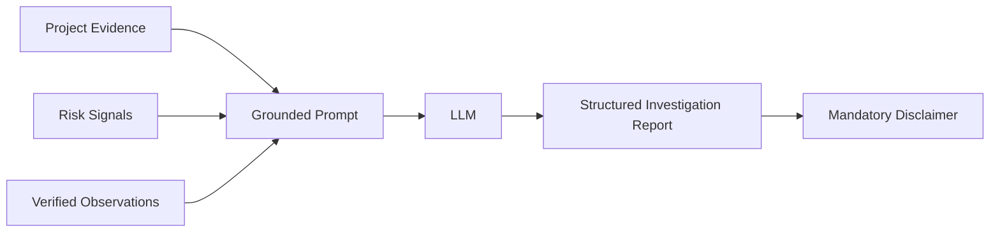
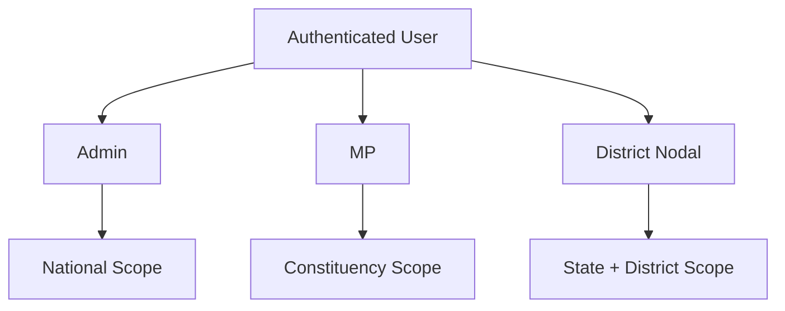
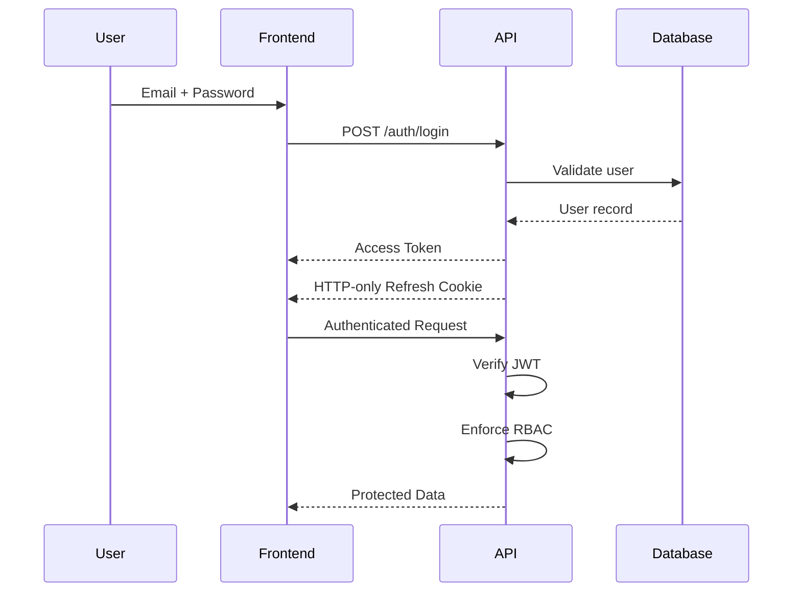
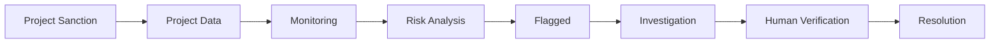

# MPLADS Drishti

### AI-Powered Project Monitoring, Risk Intelligence & Investigation Platform

**MPLADS Drishti** is an AI-powered monitoring and risk-intelligence platform designed for the **Members of Parliament Local Area Development Scheme (MPLADS)**.

Built for **Smart India Hackathon 2026 — Problem Statement #26102**, the platform brings project monitoring, financial analysis, physical-progress tracking, anomaly detection, investigation workflows, and role-based dashboards into a single system.

Instead of relying only on static reports or manual inspection, Drishti combines deterministic rules, statistical anomaly detection, machine-learning models, financial signals, and grounded AI-generated investigation reports to help authorized officials identify projects that require further review.

> **Important:** Risk scores and AI-generated anomaly signals are indicators for investigation and verification. They do not independently establish fraud, corruption, or wrongdoing.

---

## Table of Contents

* [Why Drishti](#why-drishti)
* [Core Capabilities](#core-capabilities)
* [System Architecture](#system-architecture)
* [End-to-End Data Flow](#end-to-end-data-flow)
* [Risk Intelligence Pipeline](#risk-intelligence-pipeline)
* [Machine Learning Architecture](#machine-learning-architecture)
* [Risk Scoring](#risk-scoring)
* [Investigation Intelligence](#investigation-intelligence)
* [AI Investigation Reports](#ai-investigation-reports)
* [Role-Based Access Control](#role-based-access-control)
* [Authentication & Security](#authentication--security)
* [Frontend](#frontend)
* [Backend API Gateway](#backend-api-gateway)
* [Database](#database)
* [API Overview](#api-overview)
* [Dashboard & Visualization Flow](#dashboard--visualization-flow)
* [Geographic Intelligence](#geographic-intelligence)
* [Project Lifecycle](#project-lifecycle)
* [Repository Structure](#repository-structure)
* [Technology Stack](#technology-stack)
* [Local Development](#local-development)
* [Environment Variables](#environment-variables)
* [Production Deployment](#production-deployment)
* [Testing & Validation](#testing--validation)
* [Current Implementation Status](#current-implementation-status)
* [Known Limitations & Roadmap](#known-limitations--roadmap)
* [Design Principles](#design-principles)
* [License](#license)

---

# Why Drishti

MPLADS involves a large number of geographically distributed development works, with information spanning:

* Project sanctions
* Allocated funds
* Expenditure
* Physical progress
* Completion timelines
* Payment patterns
* Risk indicators
* Constituency and district information
* Investigation status

Traditional monitoring can make it difficult to identify unusual projects early.

**Drishti addresses this by turning project data into an intelligence pipeline:**

```text
Project Data
     │
     ▼
Data Processing
     │
     ├───────────────┐
     ▼               ▼
Rule Engine      ML Engines
     │               │
     │       ┌───────┴────────┐
     │       ▼                ▼
     │  Isolation Forest     LOF
     │       │                │
     │       └───────┬────────┘
     │               ▼
     │        Ensemble Analysis
     │               │
     └───────┬───────┘
             ▼
     Financial + Statistical
             │
             ▼
      Unified Risk Engine
             │
             ▼
     Risk Score / Risk Level
             │
             ▼
      Investigation Queue
             │
             ▼
     Grounded AI Report
             │
             ▼
     Human Verification
```

The objective is not to replace human oversight.

The objective is to help authorized officials answer:

> **"Which projects should I look at first, and why?"**

---

# Core Capabilities

## 1. Multi-Role Dashboards

Drishti provides separate experiences for:

| Role                       | Primary Scope                                |
| -------------------------- | -------------------------------------------- |
| **Admin**                  | National-level monitoring and administration |
| **MP**                     | Constituency-level project monitoring        |
| **District Nodal Officer** | State + district-level monitoring            |

---

## 2. Project Monitoring

Officials can inspect:

* Project ID
* Project description
* State
* District
* Constituency
* Sanctioned amount
* Expenditure
* Physical progress
* Project status
* Sanction date
* Completion information
* Risk score
* Risk level
* Financial risk
* Statistical anomaly indicators
* ML ensemble signals

---

## 3. Risk Intelligence

The platform combines multiple analytical approaches:

* Deterministic rule engine
* Isolation Forest
* Local Outlier Factor
* Ensemble anomaly detection
* Financial risk analysis
* Statistical anomaly analysis
* Unified risk scoring

---

## 4. Investigation Queue

Projects identified by risk engines can enter an investigation workflow.

Investigators can see:

* Risk score
* Risk level
* Primary risk signal
* Detection engines
* Investigation priority
* Confidence
* Verified observations
* Recommended investigation actions
* Grounded AI investigation reports

---

## 5. Geographic Intelligence

The Admin dashboard includes an interactive India risk map.

Users can:

1. View state-level risk intelligence.
2. Hover over states for summary information.
3. Select a state.
4. Inspect project counts and risk indicators.
5. Identify geographic concentrations of risk.

The map consumes the real analytics API rather than the original five-state mock dataset.

---

## 6. Financial Monitoring

The platform tracks:

* Sanctioned amount
* Expenditure
* Expenditure-related risk
* Progress-to-expenditure relationships
* Payment-pattern anomalies

---

## 7. Progress & Delay Monitoring

Projects can be analyzed using:

* Physical progress
* Sanction delay
* Completion duration
* Project status
* Risk-related progress indicators

---

## 8. AI Investigation Reports

Drishti uses a grounded LLM workflow to turn verified project evidence into a structured investigation report.

The LLM is explicitly instructed to:

* Use only supplied project evidence.
* Avoid inventing facts.
* Avoid asserting wrongdoing.
* Distinguish observations from risk indicators.
* Identify investigation priorities.
* Recommend verification steps.
* State uncertainty when information is unavailable.

---

# System Architecture



### Architectural principle

The browser is **not trusted with direct access to the ML engine or database**.

Requests follow:

```text
Browser
   ↓
Express API Gateway
   ↓
Authentication
   ↓
Authorization / Scope Enforcement
   ↓
ML Engine / Database
```

The frontend never directly communicates with FastAPI or Supabase.

---

# End-to-End Data Flow



---

# Risk Intelligence Pipeline

Drishti uses several independent detection mechanisms.

## Stage 1 — Data Ingestion

Project information provides the foundation for:

* Financial analysis
* Progress analysis
* Payment-pattern analysis
* Project-duration analysis
* State/district/constituency analysis

The project pipeline validates that processed output preserves project rows and unique work IDs.

---

## Stage 2 — Deterministic Rule Engine

The rule engine evaluates explicit project conditions.

Examples include:

* Payment-count anomalies
* Vendors-per-payment anomalies
* Sanction delays
* Completion-duration outliers
* Consistency checks
* Threshold-based project signals

Some thresholds use percentile-based cutoffs, making the rules relative to the observed project population.

---

## Stage 3 — Isolation Forest

Isolation Forest identifies projects that appear unusual compared with the overall population.

Conceptually:

```text
Normal projects
      │
      ▼
Common feature patterns

Anomalous projects
      │
      ▼
Unusual feature combinations
```

The resulting anomaly score is normalized onto a 0–100 risk-oriented scale.

---

## Stage 4 — Local Outlier Factor

LOF focuses on **local anomalies**.

This is important because a project can look normal globally while still being unusual compared with projects in a similar local neighborhood.

---

## Stage 5 — ML Ensemble

Isolation Forest and LOF are combined.

Current configured weighting:

```text
Isolation Forest → 60%
Local Outlier Factor → 40%
```

Isolation Forest receives the larger weight because it focuses on global outliers, while LOF captures local outliers.

The ensemble also records model agreement:

```text
BOTH_MODELS
ISOLATION_FOREST_ONLY
LOF_ONLY
NO_MODEL_ANOMALY
```

This makes the system more interpretable than relying on a single anomaly detector.

---

## Stage 6 — Financial Engine

The financial engine independently analyzes expenditure and payment-related behavior.

Examples include:

* Expenditure-ratio anomalies
* Payment-pattern anomalies
* Financial risk factors

Financial analysis remains separate from the ML ensemble so that multiple independent evidence channels can be preserved.

---

## Stage 7 — Statistical Engine

The statistical engine evaluates statistical deviations and stores:

* Statistical anomaly score
* Statistical anomaly level
* Statistical anomaly factors

These signals can contribute additional evidence for investigation.

---

# Machine Learning Architecture



The ensemble implementation explicitly combines global and local anomaly detection and then determines whether one or both models identify the project as anomalous.

---

# Risk Scoring

The platform uses a **0–100 risk-oriented score**.

The ML ensemble distinguishes between model agreement and score magnitude.

Conceptually:

```text
                  ┌────────────────────┐
                  │   ML Risk Score    │
                  │       0–100        │
                  └─────────┬──────────┘
                            │
             ┌──────────────┼──────────────┐
             │              │              │
             ▼              ▼              ▼
          Low/Normal      Medium          High
                                            │
                                            ▼
                                         Critical
```

The exact ensemble classification considers:

* Isolation Forest anomaly flag
* LOF anomaly flag
* Whether both models agree
* Combined ML ranking
* Configured high-risk thresholds

A project classified as `CRITICAL` requires both anomaly models to agree and the combined ranking to meet the configured critical threshold. A `HIGH` classification requires an anomaly signal plus a sufficiently high combined ranking.

### Important interpretation

A high score means:

> **The project contains stronger risk indicators relative to the system's analytical criteria.**

It does **not** mean:

> **The project is proven fraudulent.**

---

# Investigation Intelligence

The investigation queue brings together the outputs of the risk engines.



The investigation API supports filtering by:

* Risk level
* Priority category
* State
* District
* Constituency

and provides pagination for the investigation queue.

---

# AI Investigation Reports

Drishti uses a **grounded LLM approach** rather than allowing the language model to freely speculate.

The LLM receives structured project evidence such as:

* Work ID
* State
* Constituency
* Work description
* Final risk score
* Final risk level
* Primary risk source
* Detecting engines
* Active risk engines
* Financial risk level
* Statistical anomaly level
* Detection confidence
* Investigation priority
* Verified observations

The report generation workflow follows:



The report is structured around:

1. **Why This Project Was Flagged**
2. **Investigation Priorities**
3. **Recommended Next Steps**
4. **Final Assessment**

The system explicitly prevents the model from asserting that fraud, corruption, misuse of funds, or wrongdoing has occurred.

A mandatory final assessment is also enforced defensively if the model omits it.

---

# Role-Based Access Control

Drishti implements three primary roles.



| Role             | Scope                            |
| ---------------- | -------------------------------- |
| `admin`          | National data                    |
| `mp`             | User's assigned constituency     |
| `district_nodal` | User's assigned state + district |

The important architectural decision is that **scope enforcement happens in the backend**, not merely in the frontend.

For example:

```text
MP Request
    ↓
JWT
    ↓
Backend extracts constituency
    ↓
Backend forces constituency filter
    ↓
ML Engine
```

The backend's scope enforcement applies constituency filtering for MPs and state/district filtering for district nodal users.

---

# Authentication & Security

Drishti uses custom authentication based on:

* JWT access tokens
* Refresh tokens
* HTTP-only cookies
* bcrypt password hashing
* Account lockout
* Rate limiting
* Refresh-token rotation
* Server-side token revocation
* Role-based authorization

## Authentication Flow



### Access Token

* Short-lived
* Default lifetime: 15 minutes
* Stored in frontend memory
* Sent using `Authorization: Bearer <token>`

### Refresh Token

* Default lifetime: 7 days
* Stored as an HTTP-only cookie
* Stored server-side only as a SHA-256 hash
* Rotated during refresh
* Revoked after use

### Additional protection

The backend includes:

* Five-attempt account lockout
* 15-minute lockout period
* Dedicated authentication rate limiting
* Refresh-token reuse detection
* Session invalidation

The frontend also implements a single-refresh retry guard to prevent infinite 401 loops and deduplicates concurrent refresh requests.

---

# Frontend

The frontend is built with:

* React 19
* Vite
* Tailwind CSS
* React Router
* Recharts
* D3
* Axios

The main application structure is:

```text
App.jsx
│
├── AuthProvider
├── ToastProvider
├── ProtectedRoute
│
├── AdminLayout
│   ├── Dashboard
│   ├── Projects
│   ├── Project Detail
│   ├── Alerts
│   ├── Risk Engine
│   ├── Investigations
│   ├── Geographic Intelligence
│   ├── Expenditure
│   ├── Progress & Delays
│   ├── Contractors
│   └── Reports
│
├── MPLayout
│   ├── Dashboard
│   ├── Projects
│   ├── Progress
│   ├── Funds
│   ├── Risk Insights
│   └── Alerts
│
└── DistrictLayout
    ├── Dashboard
    ├── Projects
    └── Alerts
```

The frontend integration audit confirms that dashboard KPIs, risk charts, projects, investigations, geographic intelligence, expenditure, progress, and role-specific pages consume real backend APIs wherever those APIs exist.

---

# Backend API Gateway

The backend is an Express application responsible for:

* Authentication
* Authorization
* User management
* RBAC
* Scope enforcement
* API validation
* ML engine communication
* LLM integration
* Investigation report persistence
* Error handling

```text
frontend
   │
   ▼
Express API
   │
   ├── /auth
   ├── /users
   ├── /projects
   ├── /risk
   ├── /investigations
   └── /analytics
          │
          ▼
     ml_engine
```

The gateway converts internal service errors into appropriate HTTP responses and returns `503` when the risk-intelligence service is unavailable.

---

# Database

Supabase provides the PostgreSQL database layer.

Authentication-related tables include:

```text
users
│
├── id
├── name
├── email
├── password_hash
├── role
├── state
├── district
├── constituency
└── account status fields

refresh_tokens
│
├── token_hash
├── user_id
├── expires_at
├── revoked_at
└── replacement information

password_reset_tokens
│
├── token_hash
├── user_id
├── expires_at
└── used_at
```

The schema enables Row Level Security and prevents the frontend from directly accessing these authentication tables. Database access is mediated through the backend service.

Project records are represented through a `projects` repository and support filtering by:

* Risk level
* State
* District
* Constituency
* Status

---

# API Overview

## Authentication

```text
POST   /api/auth/login
POST   /api/auth/refresh
POST   /api/auth/logout
GET    /api/auth/me
PATCH  /api/auth/change-password
POST   /api/auth/forgot-password
POST   /api/auth/reset-password
```

## User Management

```text
POST   /api/users
GET    /api/users
GET    /api/users/:id
PATCH  /api/users/:id
```

## Projects

```text
GET    /api/projects
GET    /api/projects/:workId
```

## Risk

```text
GET    /api/risk/summary
GET    /api/risk/distribution
```

## Investigations

```text
GET    /api/investigations
GET    /api/investigations/:workId
GET    /api/investigations/:workId/report
```

## Analytics

```text
GET    /api/analytics/overview
GET    /api/analytics/states
GET    /api/analytics/categories
GET    /api/analytics/constituencies
```

All API responses use the common structure:

```json
{
  "success": true,
  "data": {}
}
```

The frontend service layer unwraps this envelope so components work with normalized data objects.

---

# Dashboard & Visualization Flow

The Admin dashboard combines multiple real API sources.

```mermaid
flowchart TD

    API1[/analytics/overview]
    API2[/risk/summary]
    API3[/projects]
    API4[/investigations]

    KPI[Dashboard KPIs]
    RISK[Risk Distribution]
    TOP[Top Risk Projects]
    ALERTS[Recent Investigation Flags]

    API1 --> KPI
    API2 --> RISK
    API3 --> TOP
    API4 --> ALERTS
```

### Dashboard KPIs

Current real-data metrics include:

* Total projects
* Total sanctioned amount
* Total expenditure
* Completed projects
* High + critical projects
* ML-detected projects
* Multi-engine projects

### Risk Visualization

The risk distribution is sourced from:

```text
GET /risk/summary
```

rather than static arrays.

### Top Risk Projects

The dashboard obtains project records from:

```text
GET /projects
```

and displays high-risk project information.

### Investigation Flags

Recent alerts are now sourced from:

```text
GET /investigations
```

instead of the previous mock-alert system.

---

# Geographic Intelligence

The India map is implemented with D3 and SVG rendering.

```mermaid
flowchart LR

    GEO[India GeoJSON]
    API[/analytics/states]

    MATCH[State Name Normalization]
    INDEX[State Data Index]

    MAP[D3 India Map]

    TOOLTIP[Tooltip]
    PANEL[Selected State Panel]

    GEO --> MATCH
    API --> INDEX

    MATCH --> MAP
    INDEX --> MAP

    MAP --> TOOLTIP
    MAP --> PANEL
```

The map:

1. Loads India GeoJSON.
2. Requests state analytics from the backend.
3. Normalizes state names.
4. Resolves GeoJSON/API naming differences.
5. Calculates state risk classification.
6. Colors states accordingly.
7. Provides hover tooltips.
8. Provides click-based state details.

Known naming mismatches such as `NCT of Delhi` vs `Delhi` and variations of Jammu & Kashmir are handled through normalization and aliases.

---

# Project Lifecycle



Drishti therefore supports the monitoring lifecycle from project data through analytical review and investigation.

---

# Repository Structure

```text
MPLADS-DRISHTI/
│
├── frontend/
│   ├── src/
│   │   ├── components/
│   │   ├── pages/
│   │   ├── services/
│   │   ├── utils/
│   │   └── data/
│   ├── package.json
│   └── vite.config.*
│
├── backend/
│   ├── src/
│   │   ├── config/
│   │   ├── controllers/
│   │   ├── middleware/
│   │   ├── repositories/
│   │   ├── routes/
│   │   ├── services/
│   │   └── utils/
│   ├── package.json
│   └── README.md
│
├── ml_engine/
│   ├── api/
│   ├── src/
│   ├── notebooks/
│   ├── data/
│   └── requirements.txt
│
├── database/
│   ├── auth_schema.sql
│   └── data_schema.sql
│
└── README.md
```

The three application layers are independently deployable services.

---

# Technology Stack

| Layer            | Technology             |
| ---------------- | ---------------------- |
| Frontend         | React 19               |
| Build Tool       | Vite                   |
| Styling          | Tailwind CSS           |
| Routing          | React Router           |
| Charts           | Recharts               |
| Maps             | D3 / Leaflet           |
| HTTP Client      | Axios                  |
| Backend          | Node.js + Express      |
| Authentication   | JWT                    |
| Password Hashing | bcryptjs               |
| Validation       | Zod                    |
| Database Client  | Supabase JS            |
| Database         | PostgreSQL / Supabase  |
| ML API           | FastAPI                |
| Data Processing  | pandas / NumPy         |
| ML               | scikit-learn           |
| ML Models        | Isolation Forest + LOF |
| LLM              | Groq                   |
| Hosting          | Render                 |

---

# Local Development

## Prerequisites

Install:

* Node.js 18+
* Python 3.10+
* Supabase project
* Git

---

## 1. Clone the Repository

```bash
git clone <repository-url>
cd SIH2026_techhustlers
```

---

## 2. Configure Database

Open the Supabase SQL editor and run:

```text
database/auth_schema.sql
```

This creates the authentication tables required by the backend.

If using the project-data schema, also configure:

```text
database/data_schema.sql
```

---

# 3. Start the Backend

```bash
cd backend
npm install
```

Create:

```text
.env
```

from:

```text
.env.example
```

Then configure the required Supabase and JWT variables.

Seed the initial administrator:

```bash
npm run seed
```

Start the development server:

```bash
npm run dev
```

Default:

```text
http://localhost:5000
```

---

# 4. Start the ML Engine

```bash
cd ml_engine

python -m venv .venv
```

Activate the environment.

### Windows

```bash
.venv\Scripts\activate
```

### Linux/macOS

```bash
source .venv/bin/activate
```

Install dependencies:

```bash
pip install -r requirements.txt
```

Start FastAPI:

```bash
uvicorn api.main:app --port 8000
```

Default:

```text
http://localhost:8000
```

The ML engine is intended to be accessed by the backend rather than directly by the browser.

---

# 5. Start the Frontend

```bash
cd frontend
npm install
```

Configure:

```text
VITE_API_URL=http://localhost:5000/api
```

Then:

```bash
npm run dev
```

Default:

```text
http://localhost:5173
```

---

# Environment Variables

Backend configuration includes:

```env
PORT=5000
NODE_ENV=development
FRONTEND_URL=http://localhost:5173

ML_ENGINE_URL=http://localhost:8000

SUPABASE_URL=...
SUPABASE_PUBLISHABLE_KEY=...
SUPABASE_SECRET_KEY=...

JWT_ACCESS_SECRET=...
JWT_REFRESH_SECRET=...

JWT_ACCESS_EXPIRES_IN=15m
JWT_REFRESH_EXPIRES_IN_DAYS=7

JWT_ISSUER=mplads-drishti-api

REFRESH_TOKEN_COOKIE_NAME=mplads_refresh_token

BCRYPT_SALT_ROUNDS=12

PASSWORD_RESET_TOKEN_EXPIRES_MIN=30

RATE_LIMIT_WINDOW_MIN=15
RATE_LIMIT_MAX_ATTEMPTS=20

ACCOUNT_LOCK_THRESHOLD=5
ACCOUNT_LOCK_MINUTES=15

SEED_ADMIN_NAME=System Administrator
SEED_ADMIN_EMAIL=...
SEED_ADMIN_PASSWORD=...
```

### Security Warning

Never commit:

```text
.env
SUPABASE_SECRET_KEY
JWT_ACCESS_SECRET
JWT_REFRESH_SECRET
SEED_ADMIN_PASSWORD
```

The Supabase secret/service-role key is strictly server-side and must never be exposed to the browser.

---

# Production Deployment

The architecture is designed for independent deployment:

```text
                 Internet
                    │
                    ▼
        ┌─────────────────────┐
        │ React Frontend      │
        │ Static/Web Service  │
        └──────────┬──────────┘
                   │ HTTPS
                   ▼
        ┌─────────────────────┐
        │ Express API Gateway │
        └──────────┬──────────┘
                   │ HTTPS
                   ▼
        ┌─────────────────────┐
        │ FastAPI ML Engine   │
        └─────────────────────┘
                   │
                   ▼
        ┌─────────────────────┐
        │ Supabase PostgreSQL │
        └─────────────────────┘
```

The supplied project is configured for Render deployment, with frontend, backend, and ML services deployed independently.

### Production security model

```text
Browser
   │
   │ HTTPS
   ▼
Frontend
   │
   │ HTTPS + JWT
   ▼
Backend
   │
   ├── RBAC
   ├── Scope Enforcement
   ├── Validation
   └── Authentication
          │
          ▼
     ML Engine
```

The ML engine should never be exposed directly to the browser because it does not independently authenticate users.

---

# Testing & Validation

The current integration audit reports:

```text
Frontend build
     │
     ▼
npm run build
     │
     ▼
0 errors
     │
     ▼
PASS
```

The Step 10 test matrix covers:

* Login
* Session restoration
* Logout
* Dashboard KPIs
* Risk charts
* Project lists
* Project details
* Wrong-scope access
* Slash-containing work IDs
* Risk Engine
* Investigations
* Investigation reports
* Alerts
* Geographic Intelligence
* Expenditure
* Progress & Delays
* Risk Insights
* Funds
* User Management
* 401 → refresh → retry
* 403 handling
* Production build

The supplied integration report marks these tested areas as passing.

---

# Frontend Integration Status

The frontend integration work replaced mock data wherever a corresponding backend API existed.

Examples:

| Feature                 | Previous Source        | Current Source                |
| ----------------------- | ---------------------- | ----------------------------- |
| Dashboard KPIs          | Mock data              | `/analytics/overview`         |
| Risk distribution       | Hardcoded              | `/risk/summary`               |
| Top projects            | Mock projects          | `/projects`                   |
| Recent alerts           | Mock alerts            | `/investigations`             |
| Geographic intelligence | Mock states            | `/analytics/states`           |
| MP dashboard            | Mock statistics        | Real APIs                     |
| District dashboard      | Mock statistics        | Real APIs                     |
| Project details         | Mock contractor/alerts | Real project API + ML signals |

---

# Current Implementation Status

## Production-Integrated

```text
Authentication                 ✅
JWT access tokens              ✅
Refresh token rotation         ✅
RBAC                           ✅
Backend scope enforcement      ✅
Project APIs                   ✅
Project details                ✅
Risk summary                   ✅
Risk distribution              ✅
Investigations                 ✅
Investigation reports          ✅
Dashboard KPIs                 ✅
Geographic intelligence        ✅
Expenditure monitoring         ✅
Progress & delay monitoring    ✅
MP dashboard                   ✅
District dashboard             ✅
Admin dashboard                ✅
User management                ✅
Loading states                 ✅
Error states                   ✅
Empty states                   ✅
Frontend build                 ✅
```

The integration audit reports the frontend as **READY**, with existing Steps 1–9 backend APIs correctly consumed by the frontend.

---

# Remaining Limitations & Roadmap

Not every feature is fully backed by a production API yet.

## Step 11

### Monthly Time-Series Analytics

Current limitation:

```text
Monthly expenditure trend
        │
        ▼
No dedicated time-series API
        │
        ▼
Existing dashboard mock remains
```

Planned endpoint:

```text
GET /api/analytics/timeseries
```

The integration audit explicitly identifies this as the next backend requirement.

---

## Future Work

### Contractor Intelligence

Current contractor pages still require a dedicated backend API.

Potential future capabilities:

* Contractor profiles
* Historical project performance
* Delay rate
* Project concentration
* Risk associations
* Geographic distribution

---

### PDF Report Export

A report-rendering service is still required for full PDF export.

---

### Copilot Backend Integration

The repository contains the grounded Copilot architecture, but some frontend Copilot content remains outside the Step 10 integration scope.

---

### Submit Concern Workflow

A backend concerns API is required to make the complete concern-submission workflow live.

---

# Design Principles

## 1. Evidence Before Explanation

AI should explain available evidence rather than inventing missing evidence.

---

## 2. Risk Is Not Proof

A risk score identifies projects requiring attention.

It does not establish wrongdoing.

---

## 3. Human-in-the-Loop

The intended workflow is:

```text
AI Detection
     ↓
Risk Indicator
     ↓
Investigation
     ↓
Human Verification
     ↓
Administrative Action
```

AI assists decision-making; authorized officials remain responsible for investigation and action.

---

## 4. Backend-Enforced Authorization

The frontend should never be treated as the security boundary.

```text
Frontend Role Guard
       +
Backend RBAC
       +
Backend Data Scope
```

The backend remains the authoritative authorization layer.

---

## 5. Multiple Independent Signals

Rather than depending on one model:

```text
Rules
  +
Isolation Forest
  +
LOF
  +
Financial Analysis
  +
Statistical Analysis
       │
       ▼
Unified Risk Intelligence
```

This allows investigators to see where different analytical approaches agree or disagree.

---

## 6. Explainability

Every investigation should be connected to observable evidence such as:

* Risk score
* Risk level
* Primary signal
* Detection engine
* Financial indicators
* Statistical indicators
* Verified observations
* Investigation priority

---

# Security Model at a Glance

```text
                 ┌───────────────┐
                 │    Browser    │
                 └───────┬───────┘
                         │
                    JWT Access
                         │
                         ▼
                 ┌───────────────┐
                 │ Express API   │
                 ├───────────────┤
                 │ Authenticate  │
                 │ Authorize     │
                 │ Validate      │
                 │ Scope Data    │
                 └───────┬───────┘
                         │
               ┌─────────┴─────────┐
               ▼                   ▼
        ┌─────────────┐     ┌─────────────┐
        │ FastAPI ML  │     │  Supabase   │
        │ Engine      │     │ PostgreSQL  │
        └─────────────┘     └─────────────┘
```

---

# What Makes Drishti Different

Drishti is not simply a dashboard.

It combines:

```text
                 MPLADS DRISHTI
                       │
       ┌───────────────┼────────────────┐
       │               │                │
       ▼               ▼                ▼
   Monitoring      Intelligence     Investigation
       │               │                │
       ▼               ▼                ▼
   Projects        ML + Rules       AI Reports
   Funds           Anomalies        Evidence
   Progress        Risk Scores      Priorities
   Geography       Ensemble         Verification
```

The platform therefore creates a path from:

> **Raw project data → analytical signal → risk intelligence → investigation workflow**

rather than stopping at visualization.

---

# Quick Start

For developers who already have the environment configured:

```bash
# Terminal 1 — Backend
cd backend
npm install
npm run dev

# Terminal 2 — ML Engine
cd ml_engine
python -m uvicorn api.main:app --port 8000

# Terminal 3 — Frontend
cd frontend
npm install
npm run dev
```

Then open the frontend development server.

---

# Project Status

```text
╔════════════════════════════════════════════════════╗
║                                                    ║
║              MPLADS DRISHTI                       ║
║                                                    ║
║     AI-Powered Risk & Monitoring Platform          ║
║                                                    ║
║     Frontend Integration        READY              ║
║     Backend API                 READY              ║
║     Authentication              READY              ║
║     RBAC                        READY              ║
║     Risk Intelligence           READY              ║
║     Investigation Workflow      READY              ║
║     Geographic Intelligence     READY              ║
║                                                    ║
╚════════════════════════════════════════════════════╝
```

Built for **Smart India Hackathon 2026**.

**MPLADS Drishti — From project data to actionable risk intelligence.**
