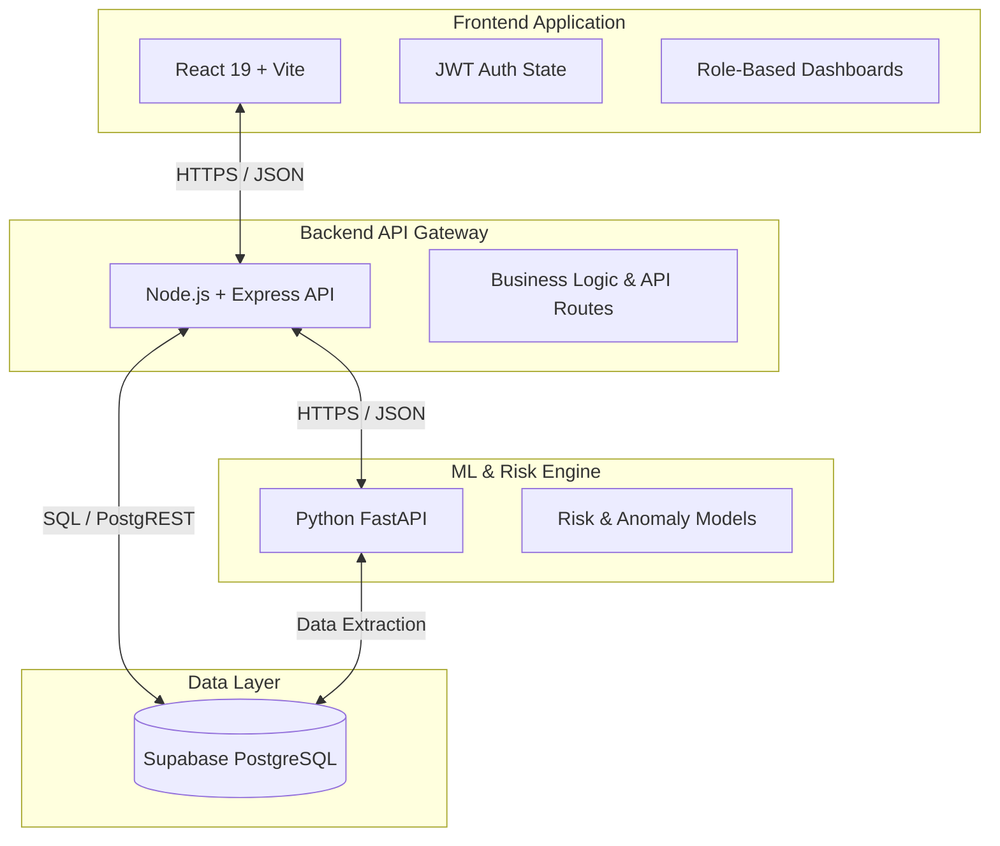

# MPLADS Drishti

MPLADS Drishti is an AI-assisted monitoring and risk-prioritization system designed to help authorities oversee the Members of Parliament Local Area Development Scheme (MPLADS). The platform aggregates project data, financial records, and timelines to identify unusual patterns, providing actionable intelligence to prioritize human investigation instead of relying purely on manual audits.

---

## Problem Statement

The Members of Parliament Local Area Development Scheme (MPLADS) enables MPs to recommend developmental works in their constituencies based on local needs. However, monitoring a massive, geographically distributed portfolio of projects is a major administrative challenge. 
- **Scale:** Thousands of projects are sanctioned annually across India.
- **Manual Overhead:** Relying entirely on manual audits makes it difficult to spot subtle financial or timeline anomalies hidden in vast amounts of data.
- **Resource Constraints:** Authorities have limited time and resources to physically inspect or deeply audit every single project.

Prioritizing which projects require immediate investigation is critical to ensure efficient use of public funds and timely completion of development work.

---

## Our Solution

MPLADS Drishti acts as a decision-support system for District Authorities, MPs, and Administrators. By analyzing project and financial information, the system highlights unusual or high-risk projects. 

**Core Workflow:**
1. **Government/MPLADS Data** (Sanctions, expenditure, timelines, vendor data)
2. **Data Validation & Processing** 
3. **Feature Engineering**
4. **Rule-Based Checks** (Deterministic thresholds like abnormal delays)
5. **Anomaly Detection / Risk Analysis** (Unsupervised ML for complex pattern detection)
6. **Risk Score** (A unified 0-100 metric)
7. **Explainable Risk Reasons** (Plain-text justification for flags)
8. **Dashboard** (Role-based visual insights)
9. **Human Investigation** (Final verification by authorities)

---

## Key Features

- **Role-Based Dashboards:** Distinct, scoped views for System Admins, MPs (Constituency scope), and District Nodal Officers (District scope).
- **Project Monitoring:** Track sanctioned funds, progress percentages, and project statuses (On Track, Delayed, Completed, etc.).
- **Unified Risk Scoring:** A 0-100 score assigned to projects based on multi-engine analysis.
- **Geographic Intelligence:** Interactive India Risk Map (using D3.js) to visualize risk distributions and aggregate metrics at the state level.
- **Explainable Alerts:** Clear, plain-text reasons generated by the ML engine explaining *why* a project was flagged.
- **Investigation Management:** Dedicated views to track critical and high-risk flags that require attention.
- **AI Copilot (Drishti Copilot):** A chat-based assistant (powered by LLM) to help users query project risks and details conversationally.

---

## System Architecture



---

## AI/ML Approach

The system employs a hybrid risk-detection strategy, combining several engines:

1. **Rule Engine (Deterministic):**
   - **What it does:** Checks data against predefined thresholds (e.g., severe sanction delays, unusually high number of payments, or 95th-percentile completion duration).
   - **Why it is used:** To catch obvious compliance or timeline violations that don't require complex statistical models.
   
2. **Isolation Forest & Local Outlier Factor (Unsupervised ML):**
   - **What it does:** An ensemble approach blending Isolation Forest (for global anomalies) and LOF (for local anomalies in dense clusters).
   - **Why it is used:** To identify projects with multi-dimensional deviations—patterns that look fundamentally different from the majority of normal projects.

3. **Financial & Statistical Engine:**
   - **What it does:** Analyzes expenditure ratios and payment patterns.
   - **Why it is used:** To flag abnormal financial burn rates or suspicious payment structuring.

4. **Unified Risk Engine:**
   - **What it does:** Aggregates the signals from the Rule, ML, and Financial engines to produce a final, normalized 0–100 risk score.

> **Note:** The ML engine detects *data anomalies*. It is designed for pattern recognition, not to explicitly determine fraud without human context.

---

## Data Pipeline

1. **Raw Data Ingestion:** Project details, sanction amounts, expenditure, and milestones.
2. **Cleaning & Preprocessing:** Handling missing values, normalizing text, and standardizing dates.
3. **Feature Engineering:** Deriving metrics like "days to sanction," "expenditure ratio," and "payment frequency."
4. **Detection & Scoring:** Passing features through the Risk Engine to generate scores.
5. **Reason Generation:** The `Risk Reason Engine` maps detected anomaly signals to human-readable explanations.
6. **Dashboard Visualization:** Risk scores and reasons are surfaced to the frontend for human review.

---

## Risk Detection & Explainability

The system identifies unusual patterns such as:
- Disproportionately high expenditure vs. physical progress.
- Severe administrative delays in project sanctioning.
- Abnormal vendor payment frequencies.

### Explainability
When a project receives a High or Critical risk score, the system does not just show a number. The `Risk Reason Engine` provides explicit signals (e.g., *"Expenditure is 90% but physical progress is only 20%"* or *"Project completion took 3x longer than the state average"*). 

**Disclaimer:** *An anomaly or high-risk score is not proof of fraud. It is a signal that can help prioritize further investigation by human auditors.*

---

## User Roles

The platform enforces Role-Based Access Control (RBAC):
- **System Admin:** Full access to view nationwide data, risk engine health, all investigations, and geographical intelligence.
- **Member of Parliament (MP):** Access scoped specifically to their constituency. Can view their recommended projects, fund utilization, and localized alerts.
- **District Nodal Officer:** Access scoped to their specific district. Monitors project execution, tracks delays, and reviews district-level anomaly flags.

---

## Technology Stack

| Component | Technologies Used |
|---|---|
| **Frontend** | React 19, Vite 8, Tailwind CSS 4, Recharts, D3.js |
| **Backend API** | Node.js, Express.js, JWT Auth |
| **ML/Risk Engine**| Python, FastAPI, scikit-learn, Pandas, NumPy |
| **Database** | Supabase (PostgreSQL) |
| **Authentication**| Custom JWT implementation (HttpOnly cookies + Bearer tokens) |

---

## Project Structure

```text
SIH2026_techhustlers/
├── frontend/             # React application (UI, Dashboards, State)
│   ├── src/components/   # Reusable UI elements, Charts, Maps
│   ├── src/pages/        # Role-based dashboard pages
│   └── src/services/     # API integration (Axios)
├── backend/              # Express API Gateway
│   ├── src/controllers/  # Route handlers
│   ├── src/routes/       # API route definitions
│   └── src/services/     # Core business logic
└── ml_engine/            # Python Risk Analysis Service
    ├── api/              # FastAPI endpoints
    └── src/              # ML Models (Anomaly, Rules, Unified Engine)
```

---

## Installation & Setup

### Prerequisites
- Node.js (v18+)
- Python (3.9+)
- A Supabase account (for database)

### 1. Database Setup
Ensure you have a Supabase PostgreSQL instance running. Run the necessary SQL migrations to set up the `users`, `projects`, and `investigations` tables.

### 2. Backend Setup
```bash
cd backend
npm install

# Create a .env file based on .env.example
# Add your SUPABASE_URL, SUPABASE_SERVICE_KEY, JWT_SECRET, etc.

npm run dev
# The backend will start on http://localhost:5000
```

### 3. ML Engine Setup
```bash
cd ml_engine
python -m venv venv

# Windows
venv\Scripts\activate
# Mac/Linux
source venv/bin/activate

pip install -r requirements.txt
# or pip install -r requirements-api.txt if specified

# Run the FastAPI server
uvicorn api.main:app --reload --port 8000
```

### 4. Frontend Setup
```bash
cd frontend
npm install

# Create a .env file and set VITE_API_URL=http://localhost:5000

npm run dev
# The frontend will start on http://localhost:5173
```

---

## Usage

1. **Start all three services** (Frontend, Backend, ML Engine) as described above.
2. **Access the App:** Open `http://localhost:5173` in your browser.
3. **Log in:** Use the login portal. The system will route you to the correct dashboard based on your assigned role (Admin, MP, or District).
4. **Monitor:** View KPIs, project lists, and completion rates.
5. **Investigate:** Navigate to the "Alerts" or "Investigations" tab to view projects flagged by the ML engine, complete with explainable reasons.

---

## Limitations

- **Data Quality Dependency:** The reliability of the risk engine is highly dependent on the accuracy and timeliness of the data entered into the system. Incorrect inputs will yield unreliable outputs.
- **Physical Verification Required:** Financial and timeline anomalies cannot establish physical/material-quality fraud on their own. Field inspections are required.
- **Development State:** Some features (like specific reporting endpoints and certain UI trends) currently utilize mocked fallbacks or placeholder data while integration continues.

---

## Future Enhancements

- **Integration with Geo-tagged Evidence:** Incorporating field photographs to correlate physical progress with reported milestones.
- **Document Verification:** Using NLP to cross-check utilization certificates and vendor invoices.
- **Continuous Model Evaluation:** Implementing feedback loops where human investigation outcomes fine-tune the anomaly detection models.
- **Computer Vision:** Analyzing project site photographs to assess structural completion.

---

## Screenshots

*(Placeholders for future UI captures)*
- `[Screenshot: Admin Dashboard overview]`
- `[Screenshot: India Risk Map visualization]`
- `[Screenshot: Explainable Risk Alert Detail]`

---

## Team

Built by **Tech Hustlers** for Smart India Hackathon (SIH) 2026.

---

## Disclaimer

**MPLADS Drishti is a decision-support and risk-prioritization system.** Anomaly flags and risk scores generated by the AI models do not independently prove corruption, fraud, or administrative failure. All flagged projects require human verification and standard investigative procedures to establish factual ground truth.
